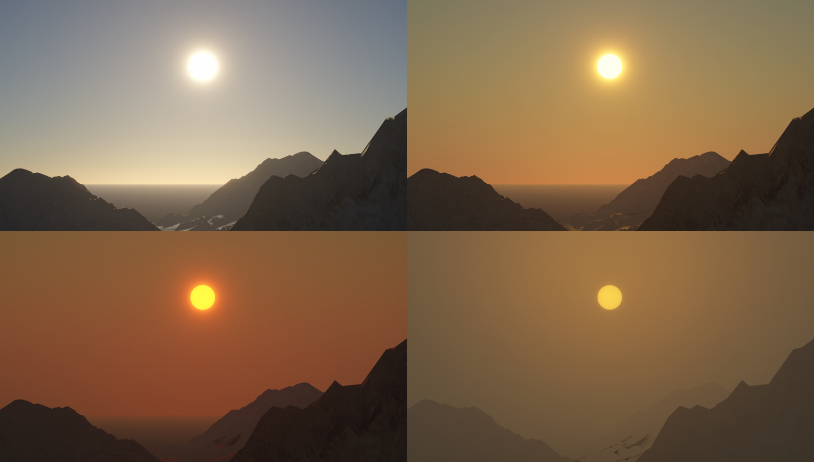
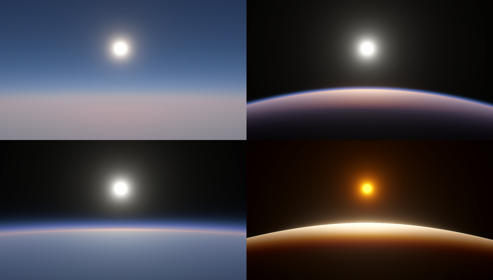

# Atmospheric Scattering for URP

 

##  Development Log
[Development Log](https://jojo-lyu.notion.site/Atmosphere-Developing-0216c5732f3a40b78fa9847e79ba342d?pvs=4)
### Pipeline Integration

- [x]  Sky Only - Sky Box
- [ ]  Sky + Scene - Post Process for Opaque(AP) and Sky(AP or Sky View), Per-Vertex AP for Transparent
- [ ]  Outer Space - Raymarching

### Basic

- [x]  URP Pipeline Integration
- [x]  Atmosphere Config
- [x]  Transmittance LUT
- [x]  Multi Scattering LUT
- [x]  Sky View LUT
- [x]  Sky Box
- [x]  Sun Disk
- [ ]  Moon Disk
- [x]  Directional Light LUT
- [x]  Ambient Light LUT
- [x]  Ground Bounce
- [ ]  AP Support
- [x]  Ray March Pass
- [ ]  Refection Probe

### Optimization

- [ ]  Sky View- Octahedral Storing, and Abandoning Horizon Below
- [ ]  Multi Scattering - Pixel Shader Implementation, and Simplify Integration Rays(64 to 2)
- [x]  LUT Update Strategy - Data Triger
- [ ]  LUT Update Strategy -Support Multi-Frames,

# References
* [Hillaire20] [A Scalable and Production Ready Sky and Atmosphere Rendering Technique](https://sebh.github.io/publications/egsr2020.pdf)
* [Bruneton08] [Precomputed Atmospheric Scattering](https://hal.inria.fr/inria-00288758/document)
* [Elek09] [Rendering Parametrizable Planetary Atmospheres with Multiple Scattering in Real-Time](http://www.cescg.org/CESCG-2009/papers/PragueCUNI-Elek-Oskar09.pdf)
* [Hillaire16] [Physically Based Sky, Atmosphere and Cloud Rendering in Frostbite](https://media.contentapi.ea.com/content/dam/eacom/frostbite/files/s2016-pbs-frostbite-sky-clouds-new.pdf)
